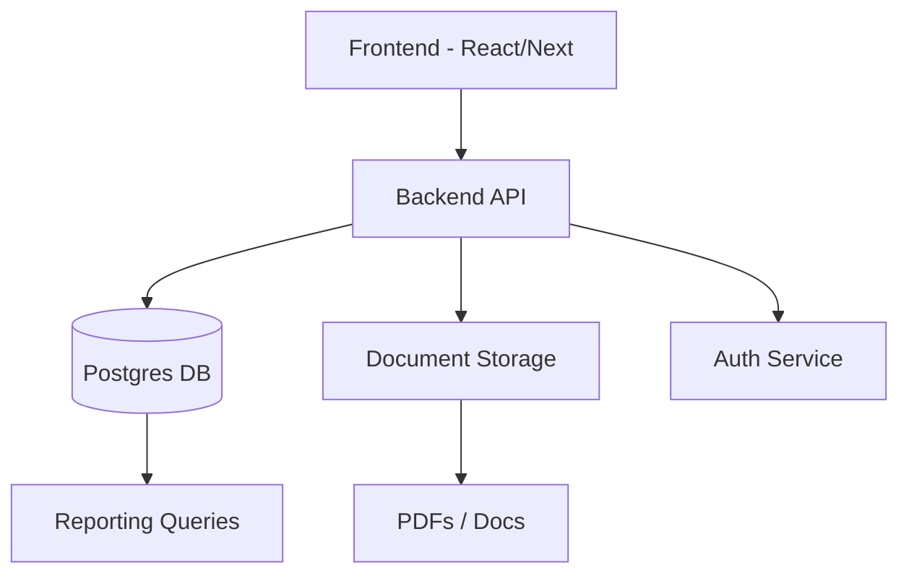
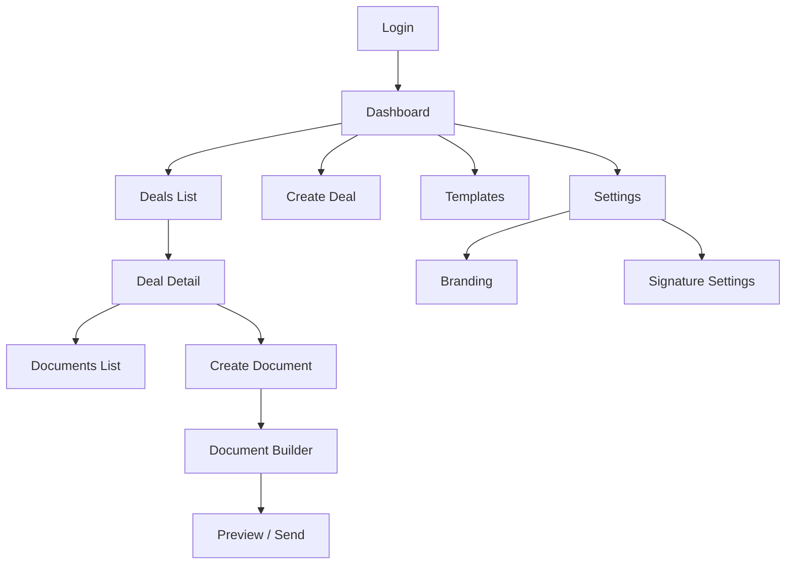
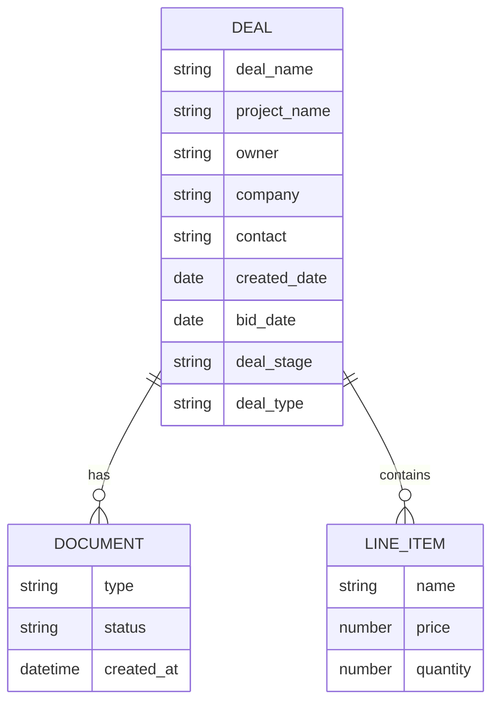
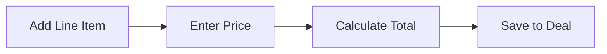
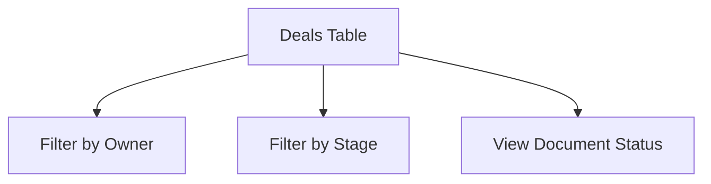

# Vizzy — Product Definition (v1)

## Overview

**Vizzy** is a document-first sales platform that enables B2B sales teams to generate clean, branded sales documents in minutes—while automatically capturing structured deal data.

Vizzy replaces fragmented workflows (Word docs, PDFs, spreadsheets) with a **guided, deal-driven document creation system**, where every document is:

- Standardized
- Branded
- Auto-filled
- Structured
- Linked to a Deal Record

---

## Core Principle

> Vizzy is not a CRM  
> It is a **document system that produces structured sales data as a byproduct**

---

## Core User Value

### Sales Rep
- Generate a clean, branded proposal in 2 minutes
- No manual tracking required

### Business Owner
- All documents automatically become pipeline data
- Instant visibility into deal status
- Reduced operational overhead

---

# Core Workflow

```mermaid
flowchart TD
    A[Start New Deal] --> B[Input Deal Fields]
    B --> C[Deal Record Created]
    C --> D[Select Document Type]
    D --> E[Auto-Fill Data]
    E --> F[Complete Missing Fields]
    F --> G[Generate Document]
    G --> H[Review & Send]
    H --> I[Document Linked to Deal]
    I --> J[Pipeline Updated Automatically]
````

---

# System Architecture

```mermaid
flowchart LR
    UI[Frontend UI] --> API[Backend API]
    API --> DB[(Database)]

    UI --> DOC[Document Renderer]
    DOC --> PDF[PDF Export]

    API --> ANALYTICS[Analytics Layer]

    DB --> DEALS[Deal Records]
    DB --> DOCS[Documents]
    DB --> ITEMS[Line Items]
```

---

# Infrastructure Overview



---

# App Structure (Pages)



---

# Data Model



---

# Key Features

## 1. Deal Record (Core Object)

* Central entity for all activity
* Stores all structured data
* Links all documents

---

## 2. Guided Deal Creation UI

* Step-by-step input
* Required fields enforced
* Designed for low-friction usage

---

## 3. Template-Driven Document Engine

* Proposal (primary v1)
* Purchase Order
* Invoice
* Receipt

---

## 4. Branding System

* Company letterhead
* Logo + styling
* Applied to all documents

---

## 5. Signature System

* Rep-level signatures
* Optional closing message
* Auto-applied

---

## 6. Document Builder

Hybrid editor:

* Structured fields
* Editable text
* Locked sections

---

## 7. Financial Table Component



* Line items
* Pricing
* Totals
* Feeds back into Deal data

---

## 8. Auto-Populated Documents

* Invoices
* Receipts
* Generated from Deal + pricing data

---

## 9. Lightweight Dashboard



* Not a CRM
* Simple database view
* Read-only insights

---

## 10. API Layer

* Create Deal
* Update Deal
* Generate Document
* Store structured data

---

# Non-Goals (v1)

* Full CRM functionality
* Activity tracking (calls/emails)
* Forecasting
* Lead management
* Complex reporting
* Automation workflows

---

# Product Strategy

Vizzy wins by:

1. Owning document creation
2. Embedding structured data capture
3. Deriving pipeline visibility automatically

---

# Summary

Vizzy transforms:

**Documents → Structured Data → Pipeline Visibility**

Without requiring users to adopt a traditional CRM.


---

## Next Step Recommendation

Before moving forward, we should:

- Convert this into **User Stories (by persona)**
- Define **MVP vs Phase 2**
- Lock **tech stack (practical, not overbuilt)**

Say the word and I’ll take you there.
